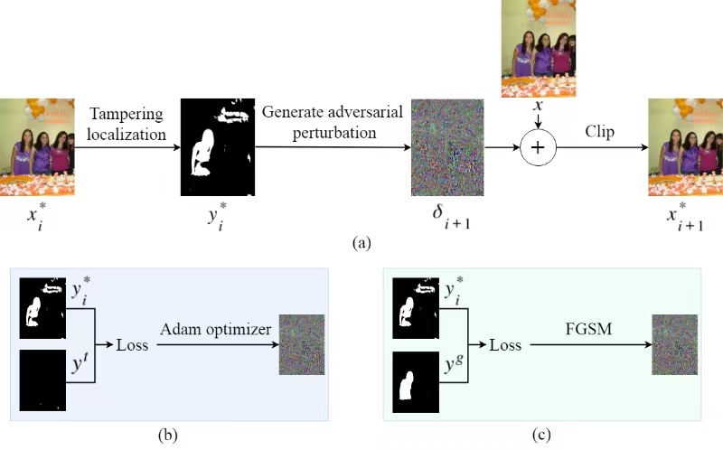

## Transferable adversarial attack on image tampering localization
An official implementation code for paper "[Transferable adversarial attack on image tampering localization](./paper.pdf)"

### Network Architecture


### Usage
preparation:
```python
python get_label.py
```

optimization-based attack:
```python
python opt.py
```
	
gradient-based attack:
```python
python grad.py
```

## Bibtex
 ```
@article{zhu2024effective,
 title={Transferable Adversarial Attack on Image Tampering Localization},
 author={Gang Cao, Yuqi Wang, Haochen Zhu, Zijie Lou, Lifang Yu},
 journal={Journal of Visual Communication and Image Representation},
 year={2024},
 publisher={Elsevier}
}
 ```
## Contact
If you have any questions, please contact me(wangyq0920@163.com).
